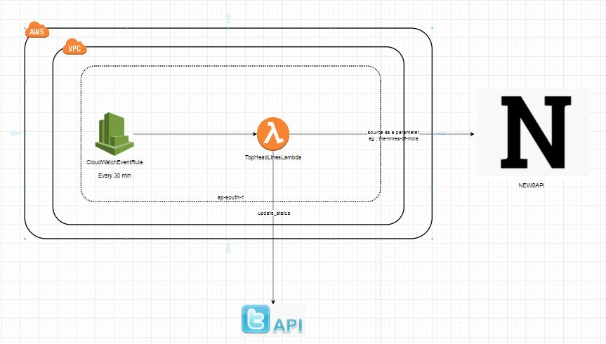

# good-morning-tweet-bot

Automated Tweet Bot:

# Description:
This project has been created to automate some of the user context twitter tasks such as tweeting, re-tweeting, direct messages to a specific twitter user. The project is in the budding stage and the vision is to extend the project at the regular intervals. And the project has been created a view that it entertains the PRs, raising the github issues to fix the issues being faced by the consumer of the project

# Solution Overview
The project is hosted on AWS Cloud infra in the form of serverless components. Automated tweet bot is a stateless software bot which meant to handle the below functionalities on behalf of the twitter user thereby reducing the work of twitter user spending time in opening the twitter app from his mobile app/ desktop application. There is a need to build a autoamted tweet bot so that it can be scheduled to invoke the twitter api on a daily basis at a specified time and greet the tweet user. 

# Use-Case Constraints
- Solution to be build in AWS Cloud
- Solution to be serverless
- Solution can use any open source library wherever applicable.

# Modules planned
- TopHeadLines Serverless service

# TopHeadLines Serverless Service
TopHeadLines Serverless service aims to retrieve a top headline from a configurable source name ( Eg: the-times-of-india) . For more information on the sources refer, https://newsapi.org/s/india-news-api
Service runs for every 30 mins and retrieve the top headline from a given news source.
newsapi provides a list of sources which newsapi.org supports and you can get the source information from newsapi python libary using the below code.


Libraries and frameworks used
1. twython - open source python library to connect with Twitter
2. newsapi - open source python library to connect with newsapi.org
3. serverless framework - open source framework used to deploy and manage the serverless component ( in this case aws lambda )

# Using twython to integrate with twitter
- You should have a valid twitter account
- Register your twitter account with twitter developer portal (https://developer.twitter.com)
- Set up a twitter app in developer api portal. This step will give you the below credentials.
    1. Consumer Credentials: Below two secrets are sufficient in order to retrieve the twitter data
        a. Consumer Key 
        b. Consumer Key Secret
     2. API Secret & API Secret Token : The below two and the consumer credentials are required in order to tweet, re-tweet and wherever posting the data to twitter is concerned.
        a. API Secret
        b. API Secret Token
```python
        app_key = os.environ['CONSUMER_KEY']
        app_secret = os.environ['CONSUMER_SECRET']
        oauth_token = os.environ['OAUTH_TOKEN']
        oauth_token_secret = os.environ['OAUTH_TOKEN_SECRET']
        
        twitter = Twython(app_key, app_secret, oauth_token, oauth_token_secret)
        twitter.update_status(status='hi, myfirst tweet through twython')
```
# Using newsapi to integrate with newsapi.org
- Register to newsapi.org website and create an account
- Create an API Key to access the end points of newsapi.org.
- Install the newsapi python library using pip install command and mention the package name in requirements.txt so that serverless framework download the required package.
- See the below code snippet to call the newsapi. For more information on newsapi python library, refer https://github.com/mattlisiv/newsapi-python
```
    news_api = NewsApiClient(api_key=os.environ['NEWSAPI_API_KEY'])
    top_headlines = news_api.get_top_headlines(sources=source_name,
                                               language='en',
                                               page_size=1)
```


